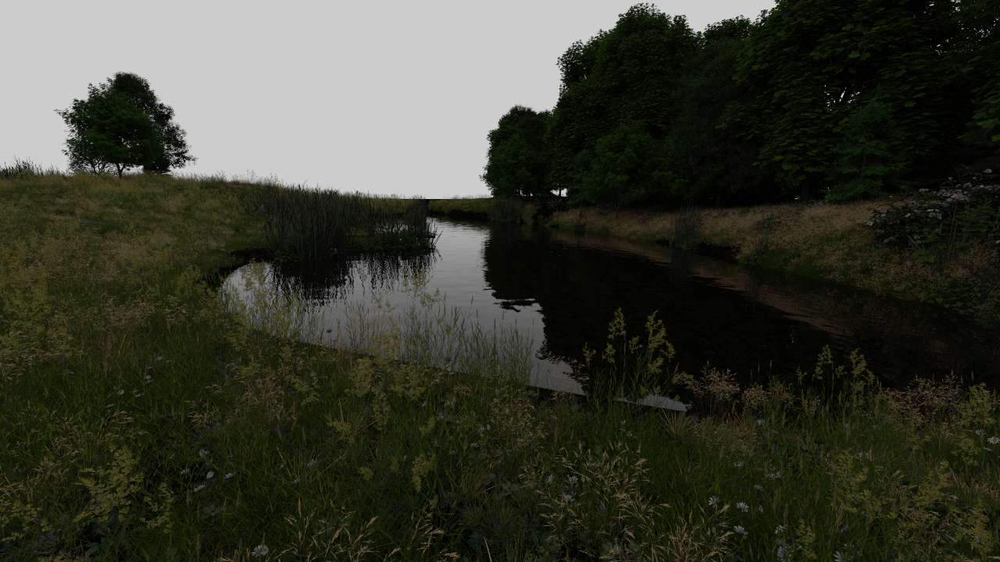

# Diopter

Vulkan 1.3 real-time path tracer using [rpp](https://github.com/TheNumbat/rpp) and [rvk](https://github.com/TheNumbat/rvk).

You can download a standalone Windows executable [here](https://github.com/TheNumbat/Diopter/releases/download/v0.1/Diopter.exe).

## Scenes

Diopter supports most [PBRT](https://pbr-book.org/4ed/contents) and [GLTF](https://www.khronos.org/glTF) scenes.
You can find scenes here:

- [pbrt-v4-scenes](https://github.com/mmp/pbrt-v4-scenes)
- [Benedikt Bitterli Rendering Resources](https://benedikt-bitterli.me/resources/)
- [glTF-Sample-Assets](https://github.com/KhronosGroup/glTF-Sample-Assets)

## Support

Diopter requires a GPU with hardware ray tracing support.
The following GPUs have been tested:

- RTX 3080ti
- RTX 4050

Diopter has only been tested on Windows, but also builds and theoretically works on linux.

## Build from Source

Download the source:
```
git clone --recursive https://github.com/TheNumbat/Diopter
```

### Windows

Install the latest [Vulkan SDK](https://vulkan.lunarg.com/), [Visual Studio Build Tools](https://visualstudio.microsoft.com/downloads/?q=build+tools), and [CMake](https://cmake.org/download/).

```
mkdir build && cd build
cmake ..
cmake --build . --config Release
```

### Linux

Install the following dependencies:

- `cmake` 3.22+
- `clang++` 17+
- `pkg-config`
- `libgtk-3-dev`
- `libsdl2-dev`

```
mkdir build && cd build
CXX=clang++ cmake .. -DCMAKE_BUILD_TYPE=Release
make -j
```

To build the shaders, you'll need to download [DXC](https://github.com/microsoft/DirectXShaderCompiler/releases) separately.

## Renders

[_Contemporary Bathroom_](https://benedikt-bitterli.me/resources/)


[_Bedroom_](https://benedikt-bitterli.me/resources/)


[_Lumberyard Bistro_](https://developer.nvidia.com/orca/amazon-lumberyard-bistro)


[_Old Vintage Car_](https://benedikt-bitterli.me/resources/)


[_Coffee Maker_](https://benedikt-bitterli.me/resources/)


[_Cornell Box_](https://benedikt-bitterli.me/resources/)


[_GPU-RT_](https://github.com/TheNumbat/GPU-RT)


[_Country Kitchen_](https://benedikt-bitterli.me/resources/)


[_Landscape_](https://github.com/mmp/pbrt-v4-scenes)


[_Landscape_](https://github.com/mmp/pbrt-v4-scenes)


[_Spaceship_](https://benedikt-bitterli.me/resources/)


[_The Wooden Staircase_](https://benedikt-bitterli.me/resources/)


[_Modern Hall_](https://benedikt-bitterli.me/resources/)


[_Glass of Water_](https://benedikt-bitterli.me/resources/)


[_Zero Day_](https://github.com/mmp/pbrt-v4-scenes)


[_Sponza_](https://github.com/KhronosGroup/glTF-Sample-Models/tree/main/2.0/Sponza)

